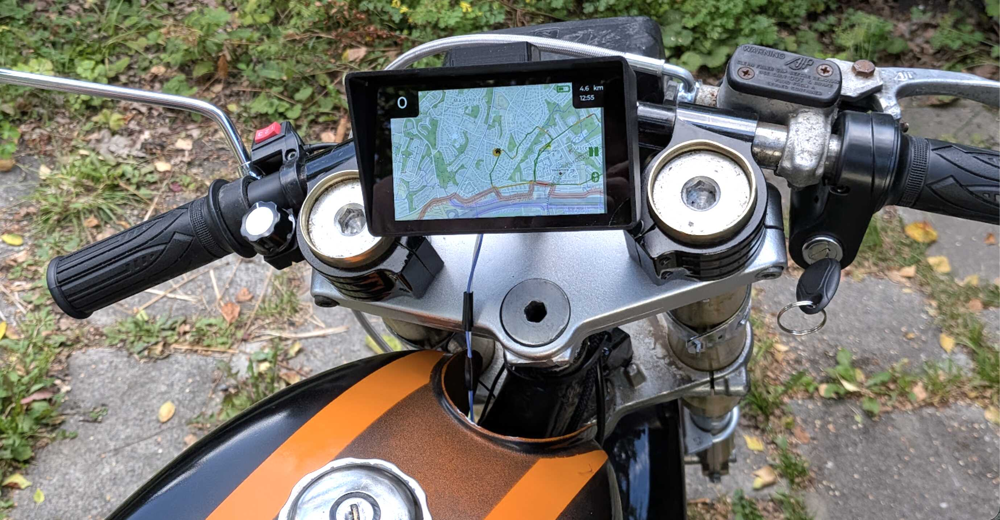
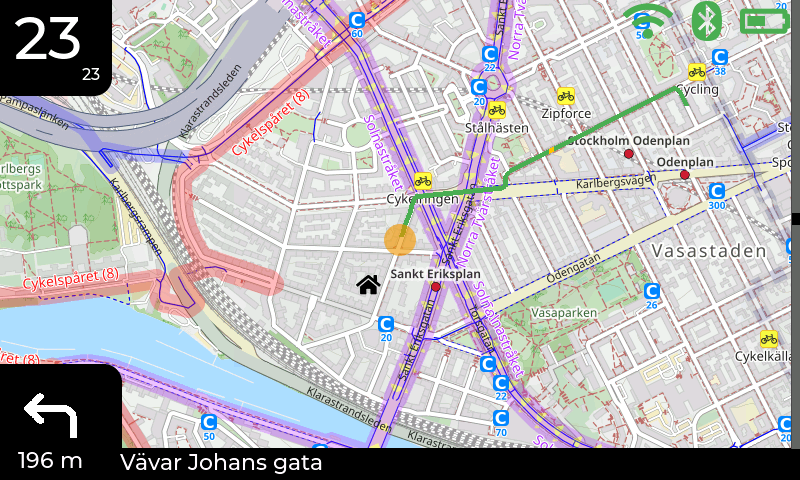
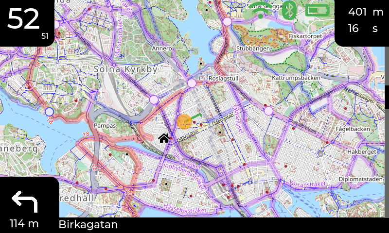
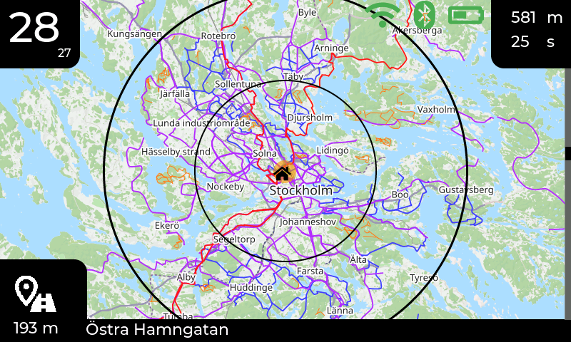
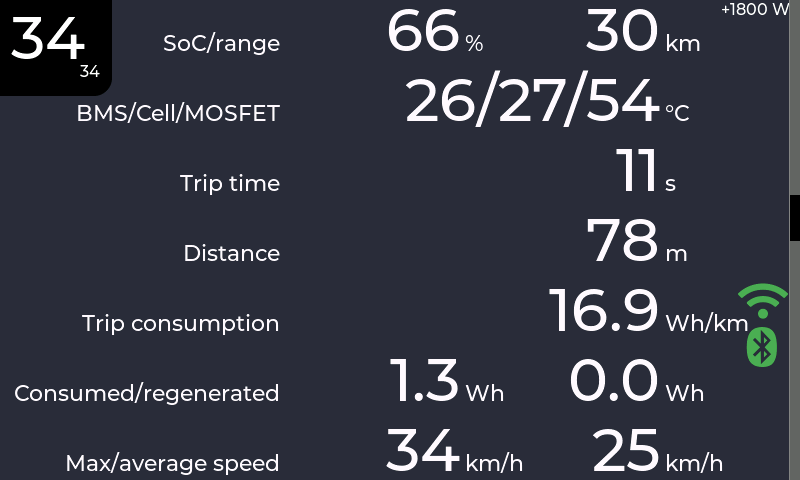
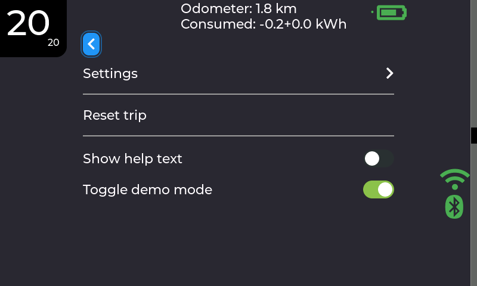

# Radbuzz
Radbuzz is an infotainment and trip computer for electric mopeds and motorcycles, for VESC-based controllers.
It's built for an ESP32P4 microcontroller, but can also be run on the desktop for testing.

<p align="center">
  <a href="doc/on_the_moped.jpg"></a>
  <a href="doc/default_zoom.png"></a>
  <a href="doc/zoomed_out.png"></a>
</p>
<p align="center">
  <a href="doc/city_zoom.png"></a>
  <a href="doc/trip_screen.png"></a>
  <a href="doc/menu.png"></a>
</p>

Features:

* OpenStreetMap-based map (currently OpenCycleMap) with different zoom levels, via a GPS module
* Speedometer, both based on VESC data and GPS
* Trip data, with average consumption, distance etc
* Tesla-style power meter bar on the right
* Supports receiving navigation instructions from Google maps via an android app
* Trip log shown on the map, with power indicator in color
* Range estimation shown on the map
* A menu for configuration
* Written in clean and modern C++ (C++23)

Hardware:

* [Waveshare 4.3" ESP32P4 Touch](https://www.waveshare.com/product/arduino/boards-kits/esp32-p4/esp32-p4-wifi6-touch-lcd-4.3.htm)
* A rotary encoder
* UART-based GPS (UBLOX Neo-6M / Neo-7M tested)
* A CAN-bus adapter to communicate with the VESC (a Waveshare SN65HVD230 has been used)
* A DC/DC converter to power the ESP32P4 from the 12V outlet on the VESC (a [Waveshare DC-DC buck mini module](https://www.waveshare.com/dc5-36-to-dc3v3-5.htm) used here)

the pinout for the ESP32P4 can be seen in [waveshare_p4_touch_4_3/main.cc](esp32/waveshare_p4_touch_4_3/main/main.cc)

## Setup

```
source $HOME/.espressif/tools/activate_idf_v6.0.0.sh
npm i lv_font_conv -g
pip3 install jinja2 pyyaml
```

## Build setup (target)
```
cmake -GNinja -B radbuzz_esp32p4 -DCMAKE_BUILD_TYPE=Release <path>/radbuzz/esp32/waveshare_p4_touch_4_3
```

## Build setup (unittest/qt)
```
cmake -GNinja -B radbuzz_unittest <path>/radbuzz/test/unittest/
```

or

```
cmake -GNinja -B radbuzz_qt <path>/radbuzz/qt
```

See [doc/build_instructions.md](doc/build_instructions.md) for more details on building and flashing the firmware.

## The OSM API key
Get an API key for thunderforest via https://www.thunderforest.com/docs/apikeys/

Put this key as a string in a `osm_api_key.txt` file in the root directory of this project.

A key can also be placed on the SD card, as osm_key.txt, which will be
preferred over the build time one if it exists.

## Wifi SSID
Store the SSIDs and passwords in a `/APP_DATA/SSID.TXT` file on the SD card, with
newlines. E.g.,

```
MySsid
PasswordForMySsid
OtherSsid
PasswordForOtherSsid
```
