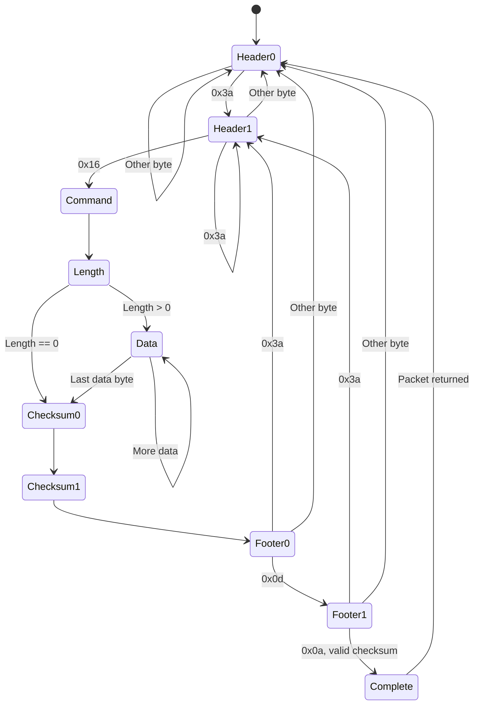

# King Shark packet protocol

Packets from the King Shark BMS look like

| 0x3a 0x16 | command | length | data (length bytes) | checksum (2 bytes, LE) | 0x0d 0x0a |
|-----------|---------|--------|---------------------|------------------------|-----------|

where the checksum is the 16-bit sum of the bytes from 0x16 to the end of the data.

The receive state machine is shown below. Each state waits for a byte: `Evaluate()` peeks at
it to choose the transition, and `Exit()` consumes it. On errors, the state machine resyncs
on the next header, without missing a header starting at the failing byte.

`Complete` holds the received packet until it has been returned from `Poll()`.

