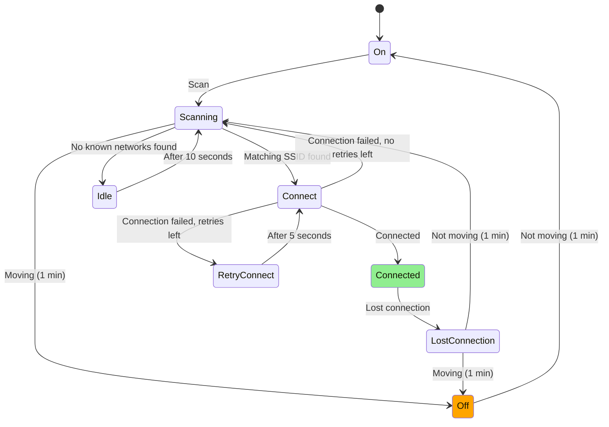

# Wifi state machine

The wifi handler connects to known networks (from `SSID.TXT` or the configuration) when the
moped is standing still, and turns off wifi when moving without a connection. An existing
connection is kept while moving, although it's expected to be lost soon.

## States

- **On**: Turn on wifi
- **Off**: Turn off wifi
- **Scanning**: Scan for networks
- **Idle**: Wait for 10 seconds before scanning again
- **Connect**: Connect to the matching network
- **RetryConnect**: Wait 5 seconds before retrying the connection
- **Connected**: Connected to a network
- **LostConnection**: The connection was lost
