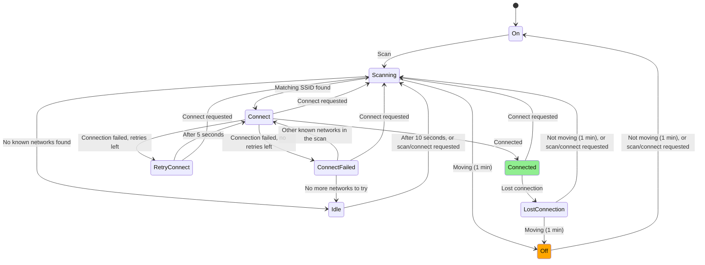

# Wifi state machine

The wifi handler connects to known networks (from `SSID.TXT` or the configuration) when the
moped is standing still, and turns off wifi when moving without a connection. An existing
connection is kept while moving, although it's expected to be lost soon.

The UI can request a scan (`MSG::start_wifi_scan`) or a network to connect to
(`MSG::wifi_connect`). A requested network is stored first among the known networks, so the
scan after the request picks it if it's in range.

```mermaid
stateDiagram-v2
    [*] --> On

    On --> Scanning : Scan

    Scanning --> Connect : Matching SSID found
    Scanning --> Idle : No known networks found
    Scanning --> Off : Moving (1 min)

    Idle --> Scanning : After 10 seconds, or scan/connect requested

    Connect --> Connected : Connected
    Connect --> RetryConnect : Connection failed, retries left
    Connect --> ConnectFailed : Connection failed, no retries left
    Connect --> Scanning : Connect requested

    ConnectFailed --> Connect : Other known networks in the scan
    ConnectFailed --> Idle : No more networks to try
    ConnectFailed --> Scanning : Connect requested

    RetryConnect --> Connect : After 5 seconds
    RetryConnect --> Scanning : Connect requested

    Connected --> LostConnection : Lost connection
    Connected --> Scanning : Connect requested

    LostConnection --> Scanning : Not moving (1 min), or scan/connect requested
    LostConnection --> Off : Moving (1 min)

    Off --> On : Not moving (1 min), or scan/connect requested

    classDef off fill:orange
    classDef connected fill:lightgreen
    class Off off
    class Connected connected
```

## States

- **On**: Turn on wifi
- **Off**: Turn off wifi
- **Scanning**: Scan for networks. Requests during the scan are covered by it
- **Idle**: Wait for 10 seconds before scanning again
- **Connect**: Connect to the matching network. A scan request waits until the connection
  has succeeded or failed, since the wifi driver can't scan while connecting
- **RetryConnect**: Wait 5 seconds before retrying the connection
- **ConnectFailed**: Skip the network until the moped has moved, or the wifi networks in the
  configuration have changed
- **Connected**: Connected to a network. A scan request scans without disconnecting, while a
  connect request disconnects and scans for the requested network
- **LostConnection**: The connection was lost
